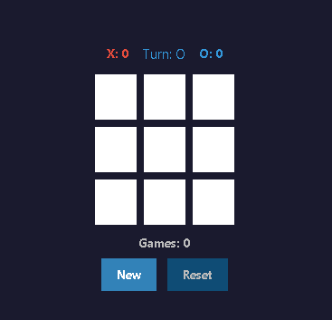

# Tic Tac Toe

A classic game of Tic Tac Toe written in python using tkinter.

# Preview

<p align="center">
  
</p>
<p align="center">
  
</p>

## How to play

This is a two player game. You can play against another player:

1. Click on a square to make a move.
2. The game will check for a win or a draw.
3. If there is a win, the game will display a message saying who won.
4. If there is a draw, the game will display a message saying it is a draw.
5. If there is no win or draw, the game will continue.

## How to run

To run the game, you can use the following command:

```
python main.py
```

Requirements:

- Python 3.x or higher
- tkinter

## Possible improvements

1. Play against the computer. (Pending)
2. Select initial player. (Completed)
3. Puntuation system. (Completed)
4. Visual style personalization (Completed).

All improvements are welcome!

